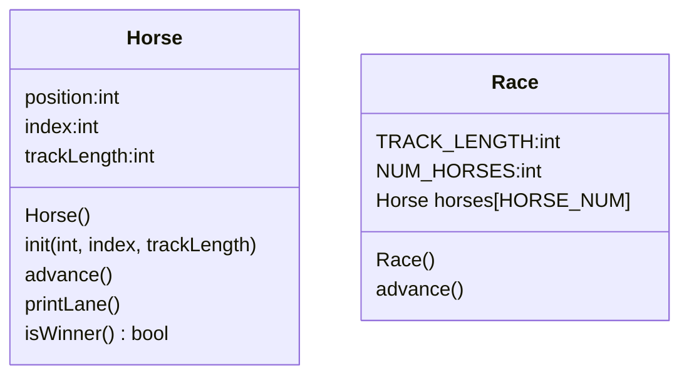

# OOPHorseRace

## UML


## Race()
```
in header
    set const static int NUM_HORSES to 5
    set constant int TRACK_LENGTH to 15
in constructor
    go through each horse
    initialize that horse by calling it's init
```

## Race.start()
```
set bool keepGoing to true
while keepGoing:
    for each horse:
        advance that horse
        print horse lane
        if that horse wins:
            set keepGoing to false
```

## Horse::Horse()
```
    set position to 0
    set index to 0
    set track_length to 15
```

## void Horse::init(int, index, int trackLength){
```
    my index = index
    my trackLength = trackLength
    my position = 0
```
## void horse::advance
```
    roll a random 0-1 int called coin
    add coin to position
```
## void Horse::printLane()
```
    for pos from 0 to track length:
        if pos == my position:
            print index
        else:
            print "."
    print newline
```

## bool  Horse::isWinner
```
    bool result = false
    if position >= trackLength
        result = true
        print come winning commentary
    return result
```


